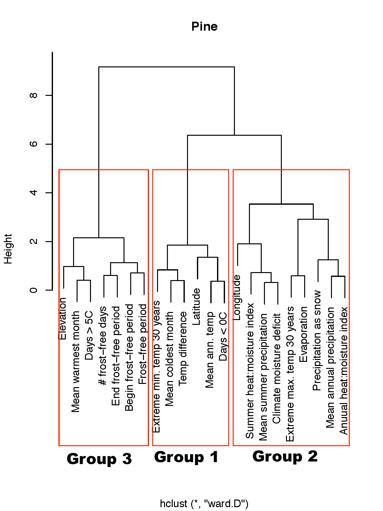

Data used here is stored on Lotterhos' laptop 
* /Users/katie/Desktop/AdaptreeData/2015_POST_FILTERING/pine_src/envi_clusters

This is a summary of the environmental data that was used for the bayenv2 and lfmm analysis for the pine data.


```{r, echo=FALSE}
### set the wd
setwd("/Users/katie/Desktop/AdaptreeData/2015_POST_FILTERING/pine_src/") 
if(!("rmarkdown" %in% installed.packages())) {install.packages("rmarkdown", dependencies=TRUE)}
if(!("limma" %in% installed.packages())) {
  source("http://www.bioconductor.org/biocLite.R")
  biocLite("limma")
  }
if(!("xtable" %in% installed.packages())) {install.packages("xtable", dependencies=TRUE)}
library(rmarkdown)
library(limma)
library(xtable)
### rmarkdown::render("driverProcessBayenvResults4VennResults.Rmd")
````

### Information about this R session
```{r}
sessionInfo()
```

### Hierarchical clustering of the environmental variables used in this study

We performed a hierarchical cluster analysis on the 22 environmental variables as a way to summarize the outliers and account for correlated variables.
```{r}
env.clust <- read.table("/Users/katie/Desktop/AdaptreeData/2015_POST_FILTERING/pine_src/envi_clusters/sprucePineEnvi.clusters", header=TRUE)
env.clust
````

In the table above, column G3 represents the group from the hierarchical clustering.  For analysis, we took out Latitude, Longitude, and Elevation and analyzed them separately because they do not represent environments per se but rather variables that correlate with other selective pressures that we didn't measure (for example elevation may correlate with UV exposure).  So column G4 was used for analysis.

An image of the clustered environments for pine:


The environments cluster into three groups.  Group 1 contains variables that correlate with mean annual temperature, Group 2 contains variables that correlate with mean annual precipitation, and Group 3 contains variables that correlate with frost-free period.  

As one mechanism to measure adaptation to correlated environmental variables, outlier SNPs were grouped into these three categories.

### Principal components of the environmental variables used in this study

As a second mechanism to measure adaptation to correlated environmental variables, we performed a principal components analysis.

```{r}
env <- read.table("/Users/katie/Desktop/AdaptreeData/2015_POST_FILTERING/pine_data/var_out_pine_all_COMBINED.table.contig_flt10.bayenv.envi2")
#head(env)

in2 <- t (env)
in3 <- prcomp (in2, scale. = T)
str(in3)
scores <- t (in3$x)
#head(scores)
#write.table (scores,"var_out_pine_all_COMBINED.table.contig_flt10.bayenv.envi2_PCA", col.names = F, row.names = F, quote = F)
#write.table (scores,"seqcap.bayenv.BF.envi2_PCA", col.names = F, row.names = F, quote = F)
barplot(in3$sdev, ylab="Standard Deviation", names.arg = 1:22, xlab="PC axis")
```

#### Distribution of environments along PC axes
```{r}
loadings <- in3$rotation
dim(loadings)
par(mfcol=c(2,2), mar=c(4,4,1,1))
  ### Left column
  plot(loadings[,1], loadings[,2], xlab="PC1", ylab="PC2", col=0, bty="l", xlim=c(-0.5,0.4))
  text(loadings[,1], loadings[,2], env.clust$enviAbb, cex=0.7)
  plot(loadings[,1], loadings[,3], xlab="PC1", ylab="PC3", col=0, bty="l", xlim=c(-0.5,0.4))
  text(loadings[,1], loadings[,3], env.clust$enviAbb, cex=0.7)

  ### Right column
  plot(loadings[,1], loadings[,4], xlab="PC1", ylab="PC4", col=0, bty="l", xlim=c(-0.5,0.4))
  text(loadings[,1], loadings[,4], env.clust$enviAbb, cex=0.7)
  plot(loadings[,1], loadings[,5], xlab="PC1", ylab="PC5", col=0, bty="l", xlim=c(-0.5,0.4))
  text(loadings[,1], loadings[,5], env.clust$enviAbb, cex=0.7)
````

#### Table and graphs of loadings for first 5 PC axes
```{r}
  rownames(loadings) <- env.clust$enviAbb
 loadings[,1:5]
```

Note that the y-axis in the following graphs are meaningless, environments are just stacked for easy readability.

```{r}
  par(mfrow=c(1,1), mar=c(4,0,0,0))
  makePCplot <- function(pc){
    plot(loadings[,pc], (rank(loadings[,pc])), bty="l", yaxt="n", ylab="", xlab=paste("PC", pc), col=0, xlim=c(min(loadings[,pc])*1.5, max(loadings[,pc])*1.5))
    text(loadings[,pc], (rank(loadings[,pc])), env.clust$enviAbb)
  }
  for (i in 1:5){
  makePCplot(i)
  }
```

#### Distribution of populations along PC axes
Note that this is the distribution of populations along PC axes with respect to their *environments*, not with respect to their *genetic structure*.  Some of these populations might be considered outliers with respect to the environments they experience.

```{r, fig.height=8}
popnames <- sub("Pi_", "", as.character(unlist(read.table("/Users/katie/Desktop/AdaptreeData/2015_POST_FILTERING/pine_data/var_out_pine_all_COMBINED.table.contig_flt10.bayenv.envi.finalpops2"))))
par(mfcol=c(2,1), mar=c(4,4,0,1))
plot(scores[1,], scores[2,], xlab="PC 1", ylab="PC 2", col=0,  bty="l", xlim=c(-6,13))
  text(scores[1,], scores[2,], popnames, cex=0.7)
plot(scores[1,], scores[3,], xlab="PC 1", ylab="PC 3", col=0,  bty="l", xlim=c(-6,13))
  text(scores[1,], scores[3,], popnames, cex=0.7)
````

### Histograms of the standardized environmental variables used in this study
Environments were scaled to have a mean of 0 and a standard deviation of 1 for Bayenv analysis
```{r, fig.height=3}
env <- read.table("/Users/katie/Desktop/AdaptreeData/2015_POST_FILTERING/pine_data/var_out_pine_all_COMBINED.table.contig_flt10.bayenv.envi2")
#head(env)
env2<-matrix(unlist(env), ncol=ncol(env))
par(mfrow=c(1,1), mar=c(6,4,2,1))
  for (i in 1:22){
    hist(env2[i,], main=env.clust$enviAbb[i], xlab=env.clust$enviDesc[i],
         xlim=c(-8,8), breaks=seq(-8,8,0.2))
  }

```
